# Perplexity推出Deep Research深度研究功能——免费可用,实测效果惊艳

---

就在几个小时前,Perplexity悄悄上线了一个让人眼前一亮的功能——Deep Research(深度研究)。说实话,当我第一次用它的时候,有种"这不就是我一直想要的研究助手吗"的感觉。它能自动执行多次搜索、阅读大量来源、生成完整报告,关键是大部分任务3分钟就能搞定。更让人惊喜的是,这个功能现在免费开放了,Pro用户无限用,普通用户每天也有免费额度。

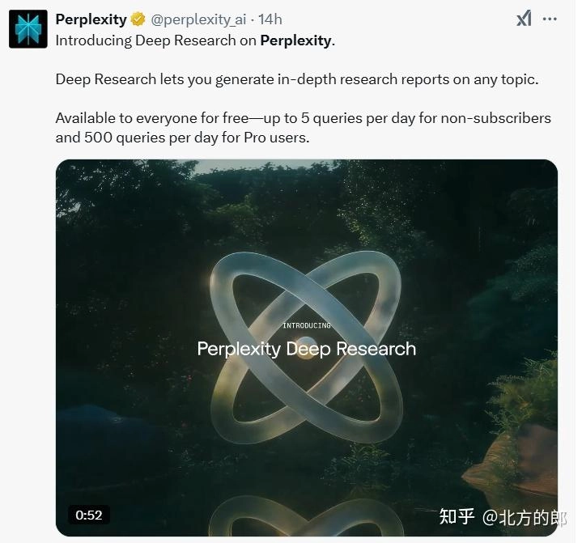

---

## 这个功能到底有多好用?

Perplexity的CEO在发布这个功能时,还特意感谢了DeepSeek。这个细节挺有意思的——说明他们在技术路线上可能借鉴了DeepSeek的一些思路。

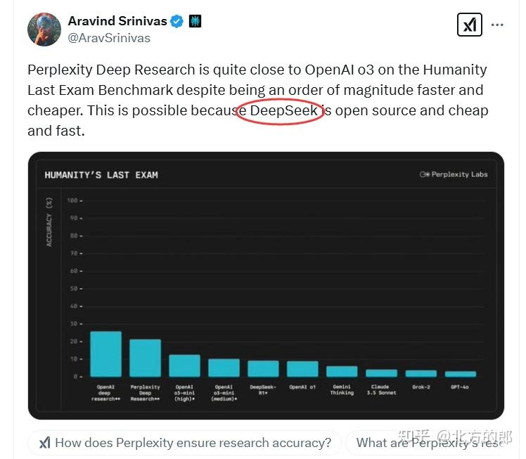

Deep Research的核心逻辑其实很简单:当你提出一个问题后,它会自动执行数十次搜索,阅读数百个来源,然后通过推理把所有信息综合成一份清晰的报告。听起来像是把人类研究员几个小时的工作压缩到了1-2分钟。

想体验的话很简单,直接访问perplexity.ai,在搜索框选择"深度研究"模式就行。网页端已经上线,iOS、Android和Mac版本也快了。

## 它是怎么工作的?

整个流程分三步:

**研究推理** —— 系统配备了搜索和编码能力,会迭代搜索、阅读文档,然后推理下一步该做什么。就像人类研究新主题一样,在过程中不断加深理解。

**报告撰写** —— 评估完所有源材料后,系统会把研究综合成一份清晰全面的报告。

**导出分享** —— 你可以把报告导出成PDF或文档,也可以转成Perplexity页面分享给别人。

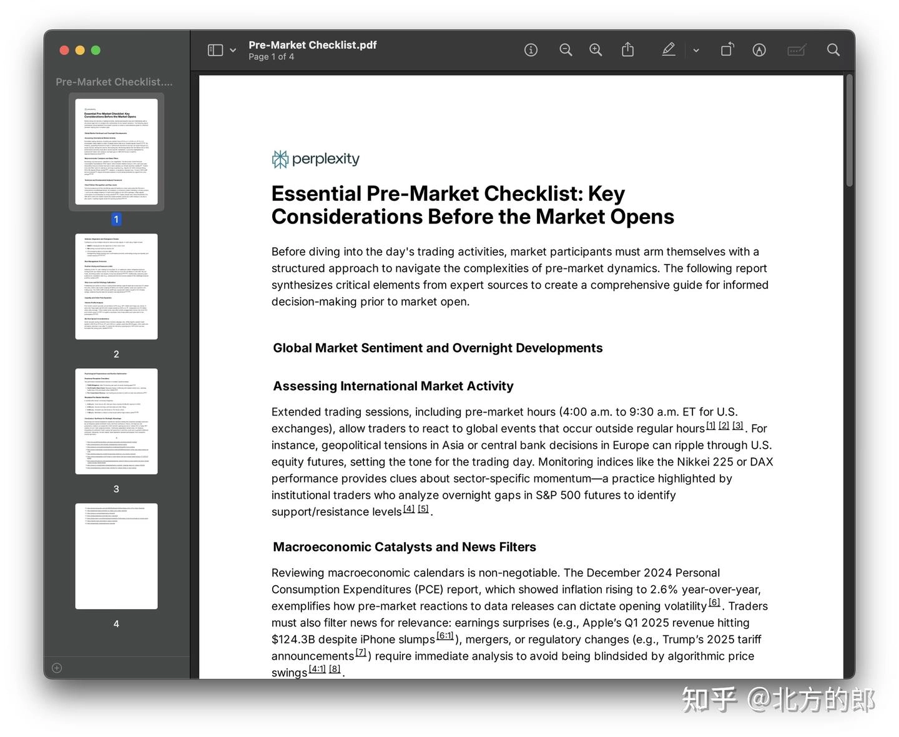

## 什么场景适合用Deep Research?

这个功能在金融、营销、技术等专业领域表现出色,同时在健康、产品研究、旅行规划这些日常场景也很实用。

**金融领域** —— 比如分析某个行业的投资机会、研究公司财报等。

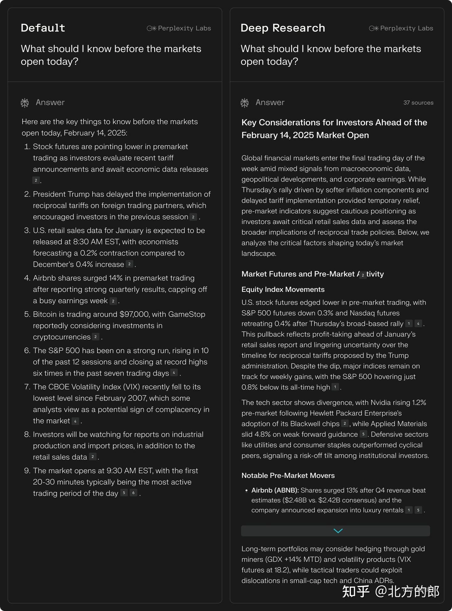

**营销领域** —— 做竞品分析、市场调研什么的特别方便。

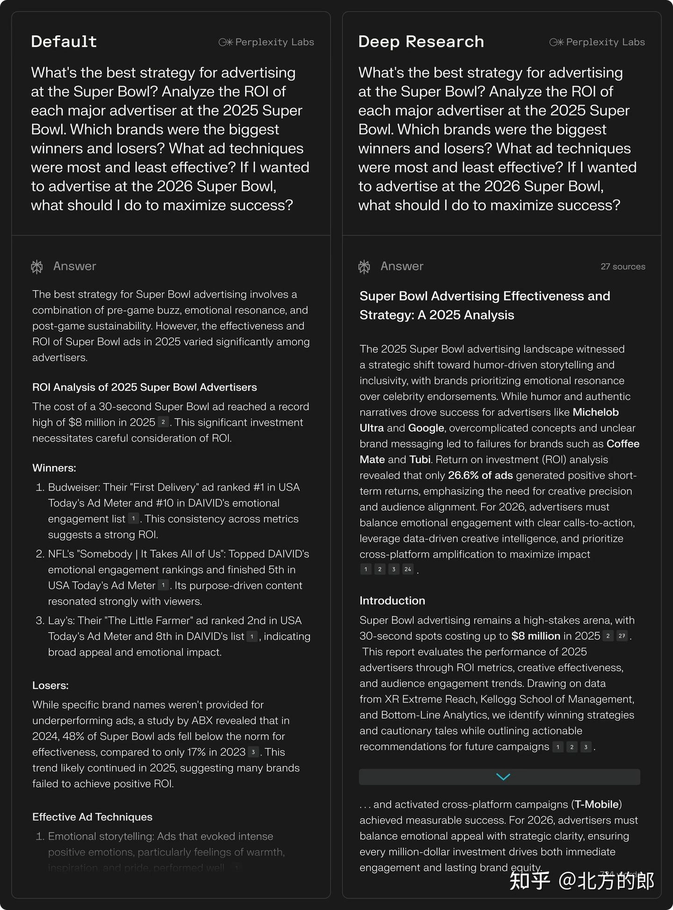

**技术领域** —— 研究技术方案、对比不同工具的优劣。

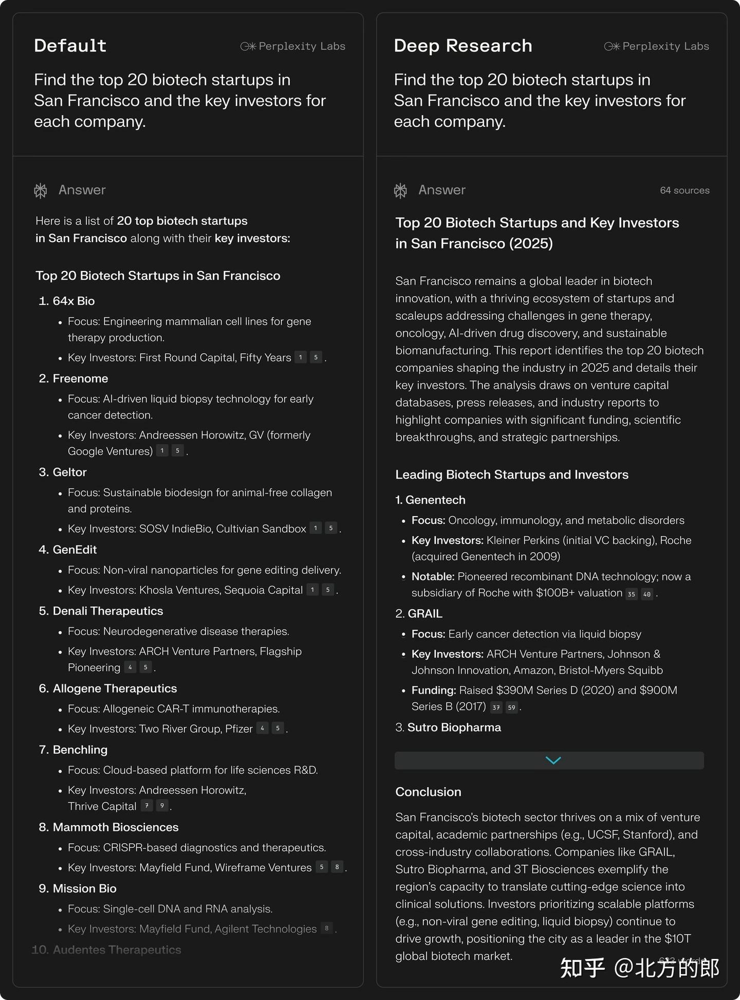

如果你经常需要快速了解某个领域或话题,又不想花大量时间搜索整理资料,👉 [想要更高效的AI研究工具?Perplexity Pro年费成品号,24H自动发货,365天质保!](https://shaoyumi.com/buy/64) 可以大幅提升你的研究效率。

**时事分析** —— 快速了解热点事件的来龙去脉。

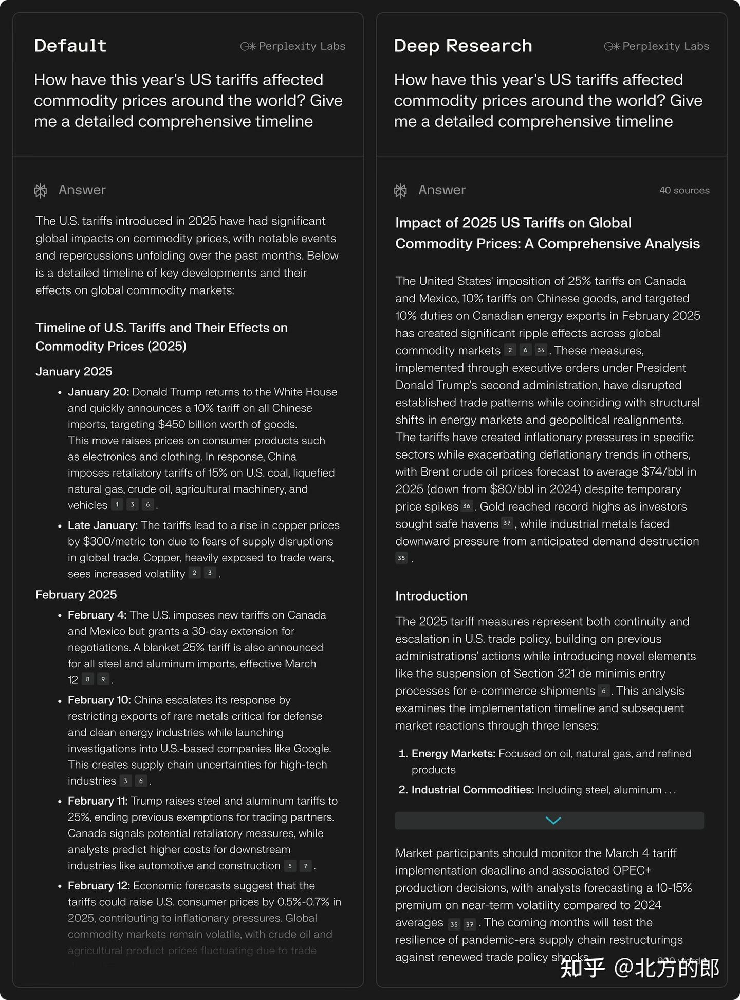

**健康咨询** —— 研究某种疾病或健康问题(当然,专业医疗建议还是要看医生)。

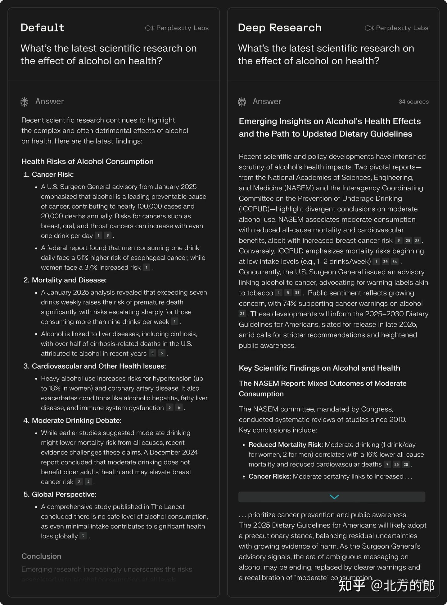

**人物传记** —— 快速了解某个人的生平和成就。

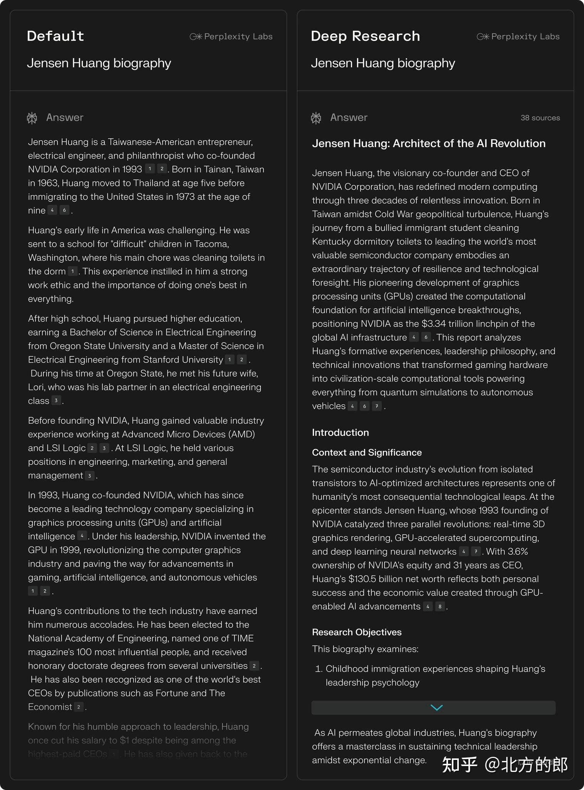

**旅行规划** —— 做行程攻略、了解目的地信息。

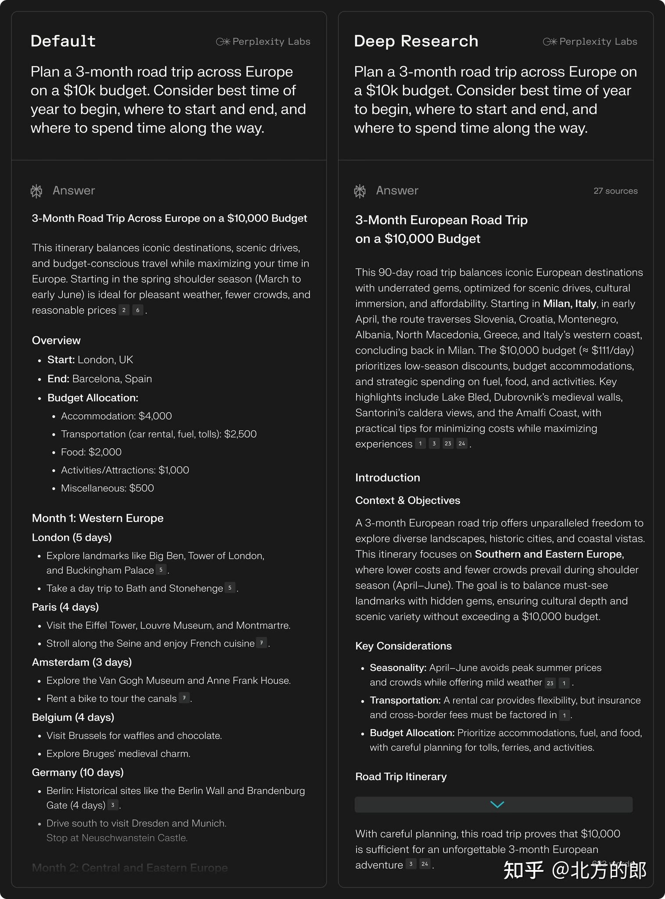

## 性能测试数据如何?

Perplexity官方给出了几组测试数据:

**Humanity's Last Exam测试** —— 这是一个包含3000多个问题、涵盖100多个主题的综合AI基准测试。Deep Research拿到了20.5%的准确率,超过了Gemini Thinking、o3-mini、o1、DeepSeek-R1等一众模型。

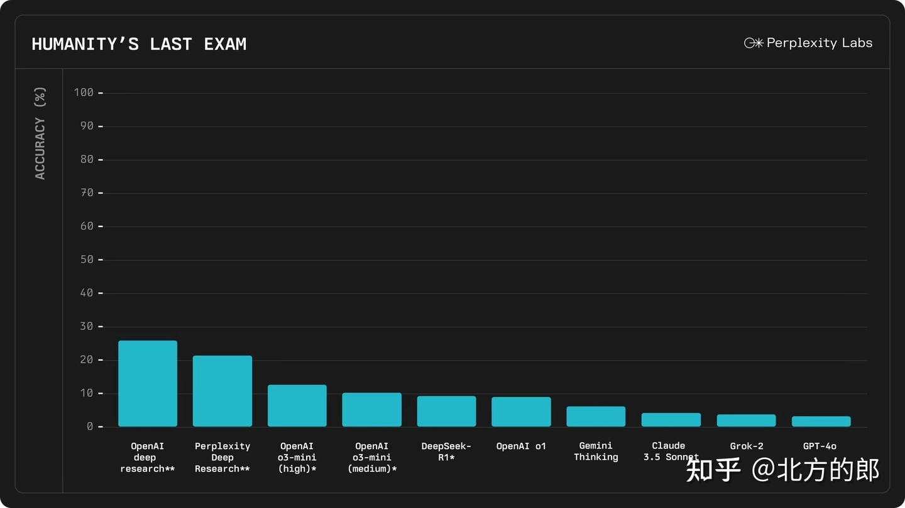

**SimpleQA测试** —— 这个测试主要检验事实准确性。Deep Research以93.9%的准确率远超其他模型。

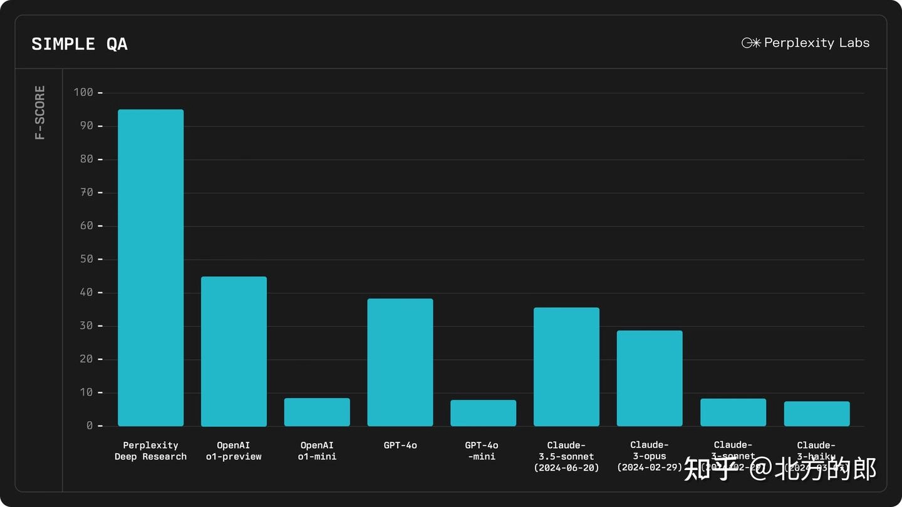

**运行时间** —— 大多数研究任务都能在3分钟内完成,官方还在继续优化速度。

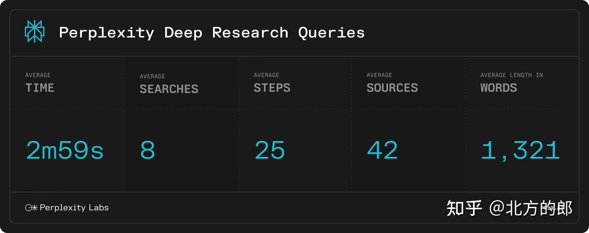

## 实测效果怎么样?

我自己测试了两个场景,感觉确实挺靠谱。

**第一个测试:大模型加速服务分析**

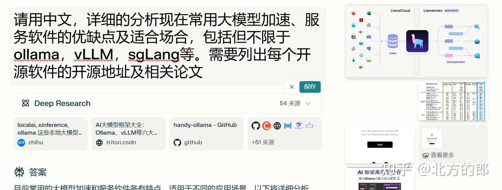

答案和引用整理得都很清晰:

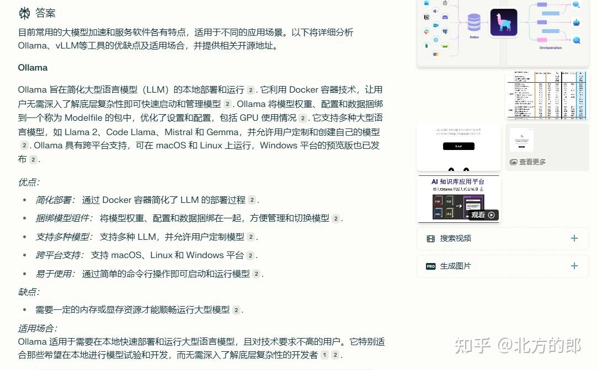

**第二个测试:ktransformers技术方案研究**

这个问题比较专业——用一块24G的GPU加大量内存部署671B的DeepSeek-R1。

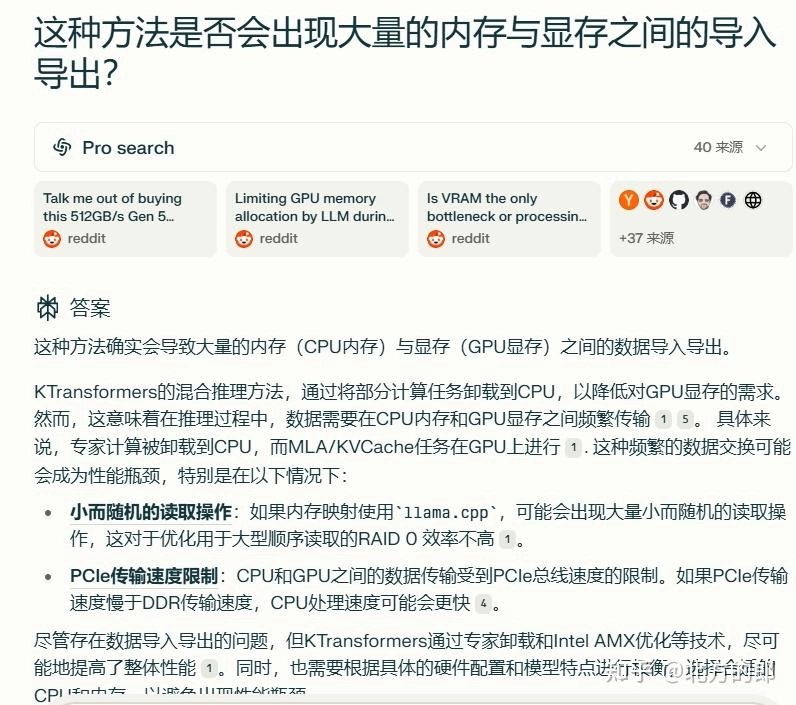

整体感觉效果非常不错,有点像知乎直答那种体验。以后这两个可以混着用,看具体需求选工具。

---

## 写在最后

Deep Research这个功能确实解决了一个真实痛点——很多时候我们需要快速了解某个领域或话题,但又不想花几个小时去搜索、阅读、整理资料。现在有了这个工具,相当于有了一个24小时在线的研究助手。

如果你经常需要做行业研究、竞品分析或者深度学习某个话题,👉 [Perplexity Pro年费成品号让你无限使用Deep Research功能,24H自动发货,365天质保!](https://shaoyumi.com/buy/64) 绝对物超所值。Pro版本可以无限次使用,而且还有更多高级功能,对于需要大量研究工作的人来说,这个投入很值得。
